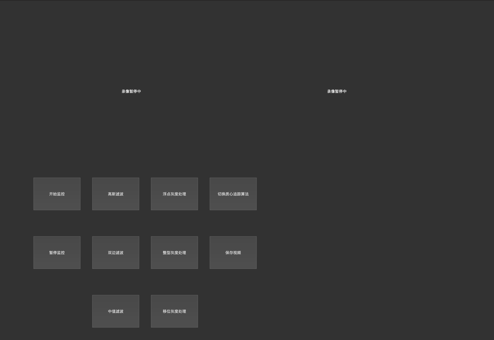
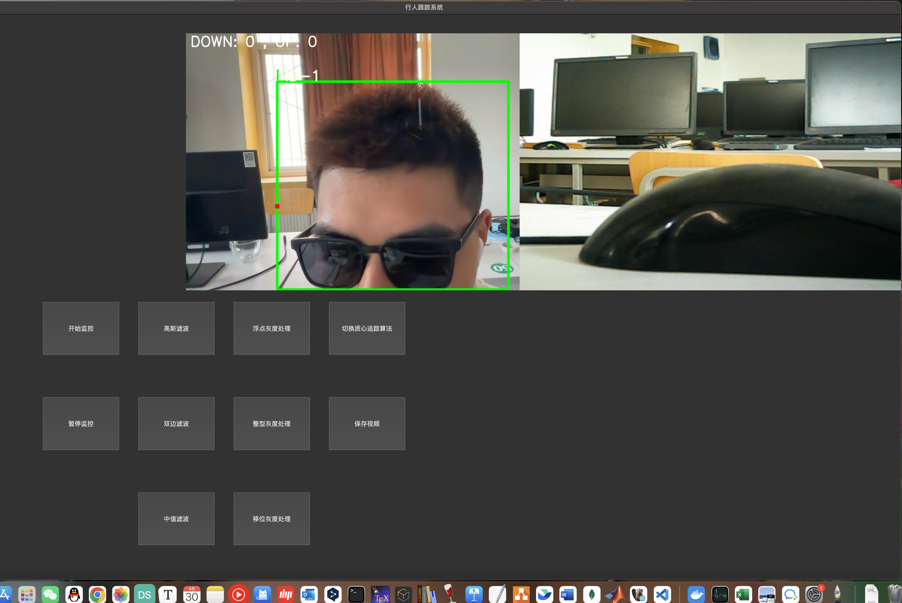

# 《跨场景多摄像头追踪系统》/Cross Scene Tracking System with OpenCV
# 项目简介/Introduction

​	该项目是我的毕业设计。我觉得对于刚接触计算机的人来说很有学习意义，因为它具备了现代物联网工程项目的基本的要素——传感器（多个摄像头）、后端部分（main.py和OpenCV视觉库）、前端界面（PyQt）。同时因为该项目使用python语言书写，借助了yolo5模型进行追踪，所以对以后接触深度学习相关内容也有一定帮助。

  This program is my undergraduate final project. It is meaningful for junior learner in computer science. It includes all the elements that in modern IoT engineering project， such as sensor(multi-camera), backend(main.py and OpenCV vision library), frontend(PyQt). As written by Python programming language, utilizing yolov5 model to track objects, it is also helpful to someone wants to be exposed to Deep Learning.

# 效果展示/Demonstration

